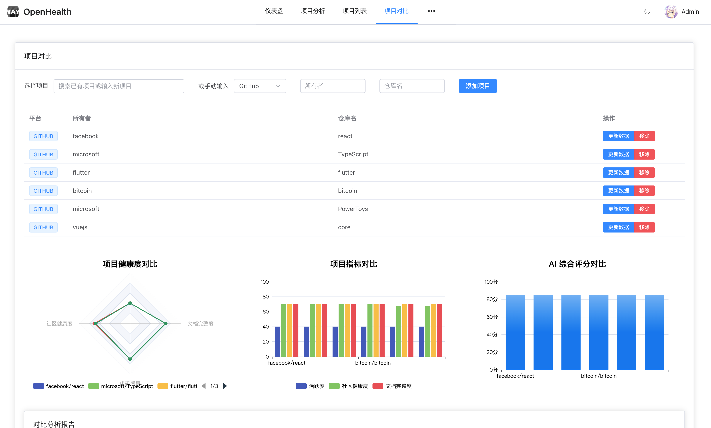

#  OpenHealth

Open Source Project Health Analysis Platform

## Introduction

OpenHealth is a platform for analyzing the health of open source projects. It helps developers evaluate and improve the health of their projects by collecting and analyzing project data. OpenHealth provides a series of metrics and analysis tools to help developers understand the current state of their projects and provide suggestions for improvement.

## Features Preview

| Feature               | Description                                                                                                                           | Preview                                      |
| --------------------- | ------------------------------------------------------------------------------------------------------------------------------------- | -------------------------------------------- |
| Project Overview      | Comprehensive dashboard showing key metrics, activity trends, and health indicators for your open source project                      |  |
| Health Score Analysis | Detailed breakdown of project health scores across different dimensions including community engagement, code quality, and maintenance |      |
| Project Comparison    | Compare multiple projects side by side to benchmark and identify areas for improvement                                                |  |
| Project List          | List all projects and their health scores                                                                                             |          |
| Project Detail        | Detailed information about a specific project                                                                                         |        |

## Project Structure

OpenHealth is built with a frontend using Vue.js, and a backend using Nest.js and MongoDB.

## Stack

- Frontend:
  - Vue.js
  - Element Plus
  - Vite
  - TypeScript
- Backend:
  - Nest.js
  - MongoDB
  - OpenDigger
  - TypeScript

## License

MIT. You can see the license in the [LICENSE](LICENSE) file.

## Author

OpenHealth ©  Way Tech, Released under MIT.
