#  OpenHealth

Open Source Project Health Analysis Platform

## Introduction

OpenHealth is a comprehensive platform designed to analyze and evaluate the health of open source projects. By collecting and analyzing various project metrics, it helps developers understand their project's current state, identify areas for improvement, and make data-driven decisions to enhance project quality. With AI suggestions, it provides a comprehensive analysis of the project's health and potential improvements.

## Key Features

| Feature               | Description                                                                                                                           | Preview                                       |
| --------------------- | ------------------------------------------------------------------------------------------------------------------------------------- | --------------------------------------------- |
| Project Overview      | Comprehensive dashboard showing key metrics, activity trends, and health indicators for your open source project                      |  |
| Health Score Analysis | Detailed breakdown of project health scores across different dimensions including community engagement, code quality, and maintenance |      |
| Project Comparison    | Compare multiple projects side by side to benchmark and identify areas for improvement                                                |  |
| Project List          | List all projects and their health scores with filtering and sorting capabilities                                                     |          |
| Project Detail        | In-depth analysis of individual projects with detailed metrics and historical data                                                    |        |

## Preview Video

https://github.com/user-attachments/assets/d05f9814-5794-44f9-9e3b-12f7596a51bc


## Technology Stack

### Frontend

- Vue.js 3 with Composition API
- Element Plus UI Framework
- Vite Build Tool
- TypeScript
- Chart.js & ECharts for data visualization

### Backend

- Nest.js framework
- MongoDB for data storage
- Redis for caching
- OpenDigger integration
- TypeScript

## Prerequisites

Before running the project, ensure you have the following installed:

- Node.js (v16 or higher)
- pnpm (v8 or higher)
- MongoDB (v4.4 or higher)
- Redis (v6 or higher)
- Docker & Docker Compose (for containerized deployment)

## Development Setup

### Backend Setup

```bash
cd open-health-backend
pnpm install
pnpm run dev
```

### Frontend Setup

```bash
cd open-health-frontend
pnpm install
pnpm run dev
```

## Deployment

### Backend Deployment

#### Option 1: Using Docker Compose (Recommended)

```bash
cd open-health-backend
docker-compose up -d
```

#### Option 2: Manual Deployment

```bash
cd open-health-backend
pnpm run build
pnpm run start
```

### Frontend Deployment

```bash
cd open-health-frontend
pnpm run build
```

After building, deploy the generated `dist` directory to your web server.

### Environment Configuration

The backend requires the following environment variables:

- `ALLOWED_ORIGINS`: Allowed CORS origins
- `JWT_SECRET`: Secret key for JWT authentication
- `MONGODB_URI`: MongoDB connection string
- `REDIS_URL`: Redis connection string

## Project Structure

```
open-health/
├── open-health-frontend/     # Frontend Vue.js application
│   ├── src/
│   ├── public/
│   └── package.json
├── open-health-backend/      # Backend Nest.js application
│   ├── src/
│   ├── docker-compose.yml
│   └── package.json
└── README.md
```

## Project Design

### Backend

#### Overall System Architecture

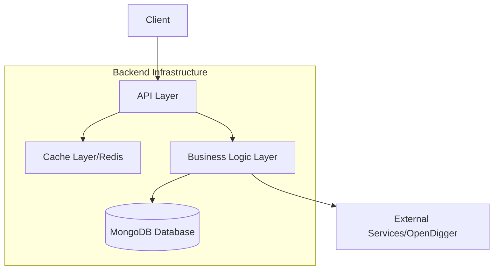

#### Core Module

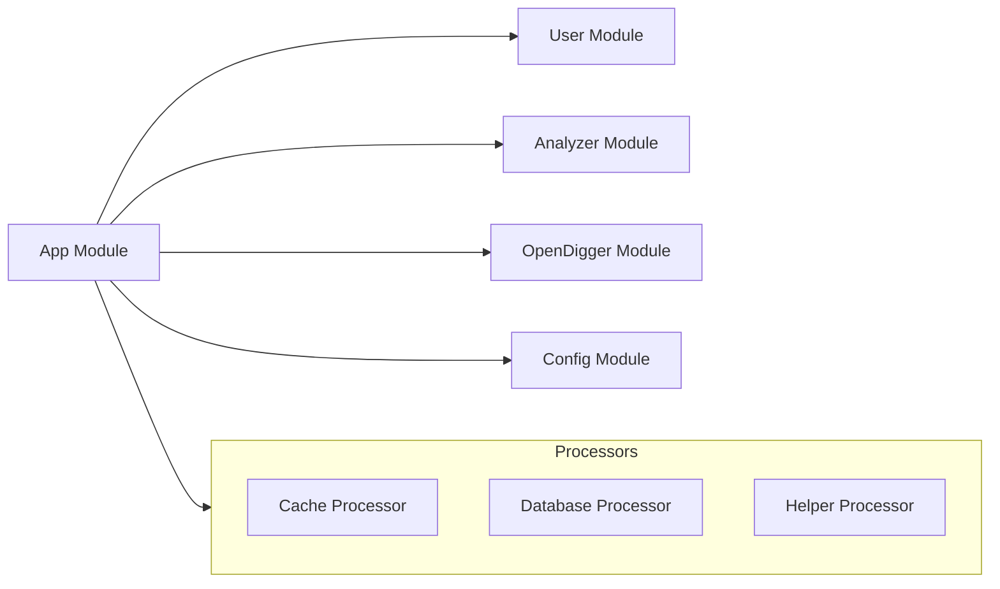

#### Middleware & Interceptors

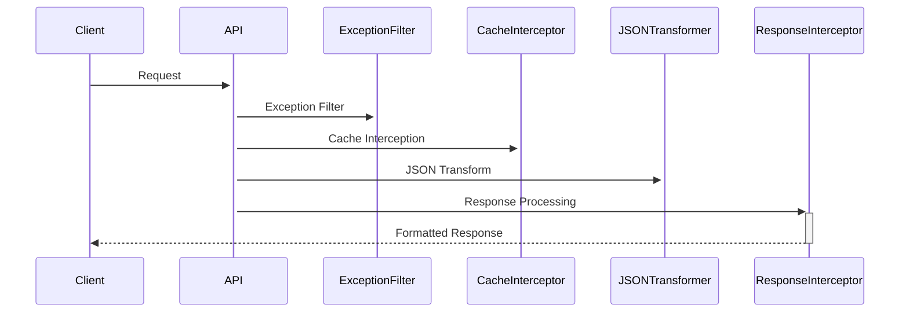

#### Cache Architecture

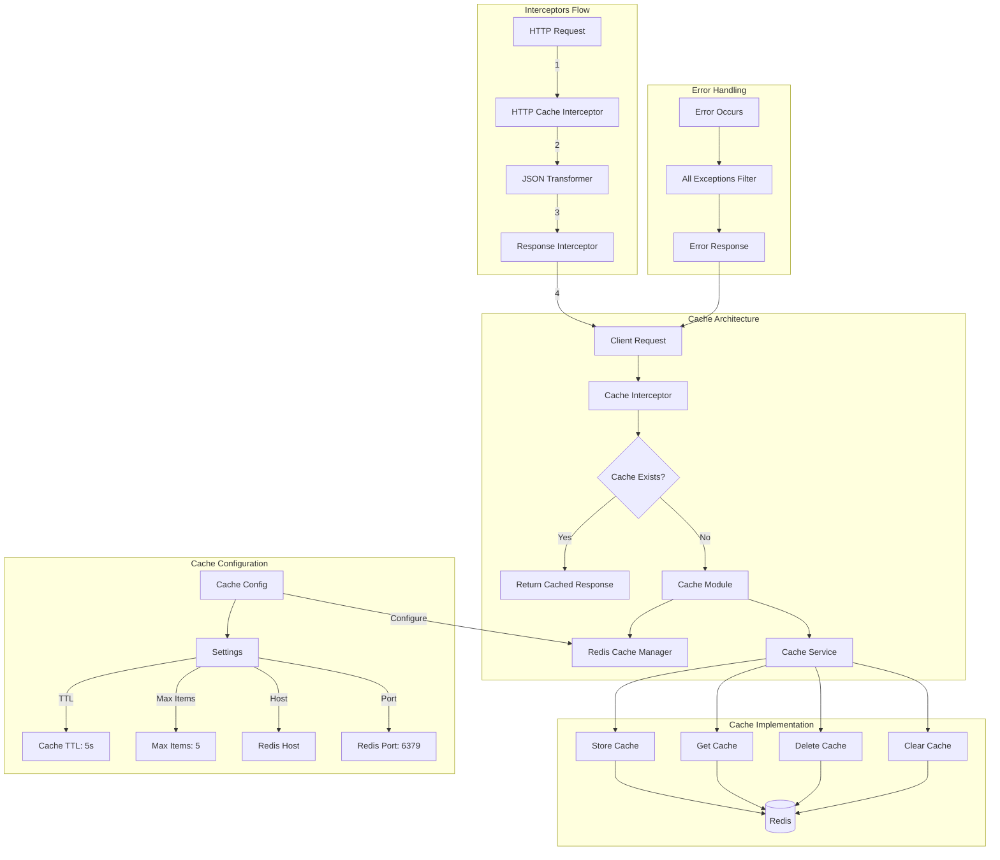

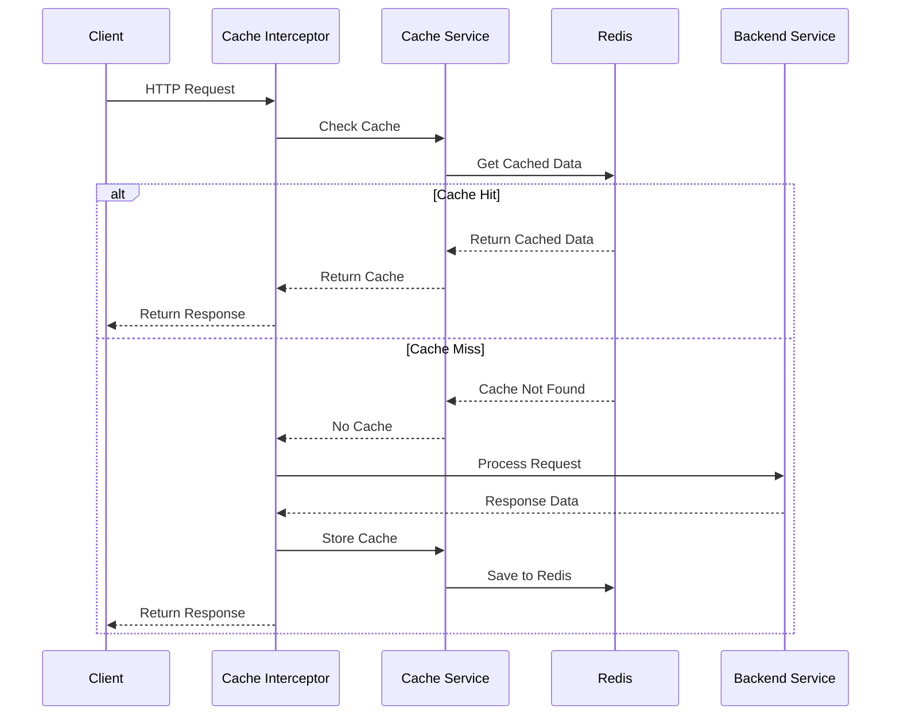

#### Deployment Architecture

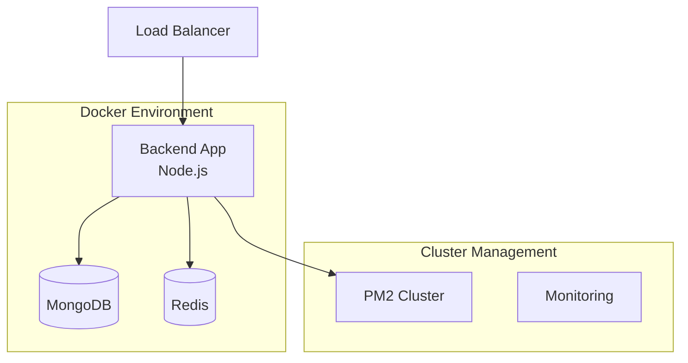

#### Data Flow

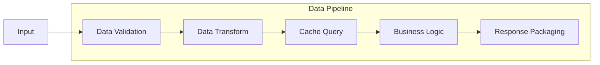

#### Full Architecture

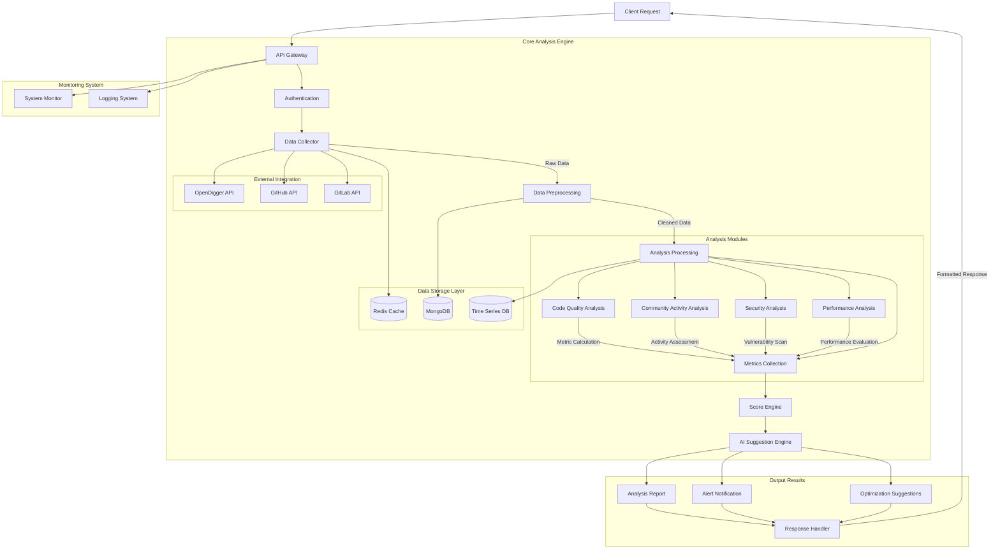

### Frontend

#### High-Level Architecture

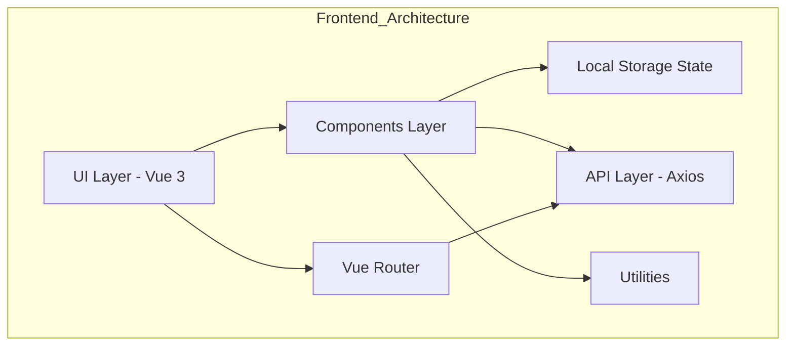

#### Core Components Structure

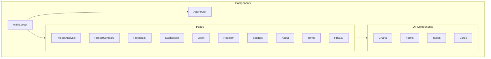

#### Data Flow Architecture

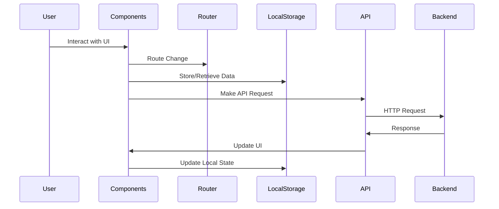

#### Feature Implementation

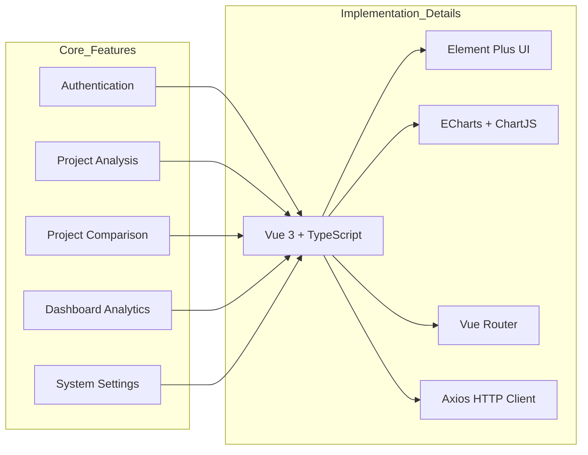

#### Theme System

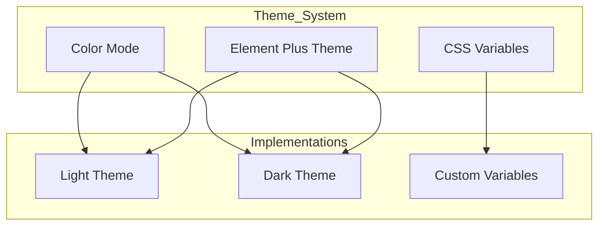

## License

This project is licensed under the MIT License - see the [LICENSE](LICENSE) file for details.

## Author

OpenHealth ©  Way Tech, Released under MIT.

## Contributing

We welcome contributions! Please feel free to submit a Pull Request.
